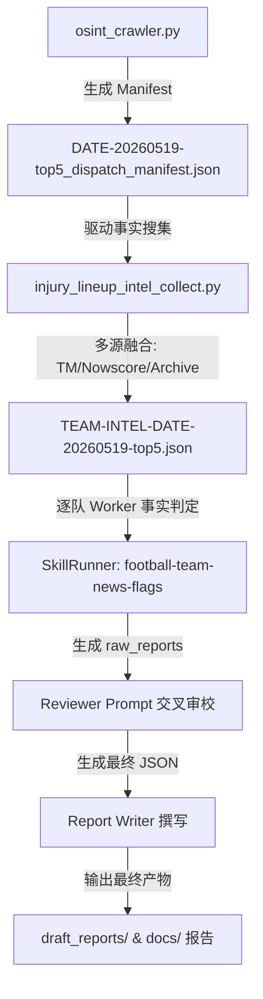

# Agent Handover: 英格兰联赛 2026-05-19 球队新闻异常检测交付与交接文档

本交接文档为针对 `2026-05-19` 日期的英格兰联赛（英超 EPL + 英冠 ELC）球队新闻与异常标志（Canonical Flags）情报采集任务所整理的技术设计与执行规范。旨在帮助后续接管的 AI 代理人或开发人员快速理清数据管道及业务逻辑，达成无缝衔接。

---

## 1. 核心需求本质与技术现状

### 需求本质
用户期望获取 `2026-05-19` 日期的“英超 30 支球队”的新闻与异常异常标志判定。
*   **实际球赛日程分析**：英超（EPL）在 2026-05-19 这一天共排有 **2 场超级焦点战**（涉及 4 支顶级球队）：
    1.  **Bournemouth vs Manchester City**（伯恩茅斯 vs 曼城：曼城正值夺冠窗口期，少赛一轮积 77 分，暂居第二，此役事关夺冠）
    2.  **Chelsea vs Tottenham**（切尔西 vs 热刺：伦敦德比，关乎切尔西和热刺能否搭上欧战末班车）
*   **30 支球队的对齐方案**：英格兰超级联赛常规仅有 20 支球队，单日有战术任务的为上述 4 支。为了尽可能覆盖更广泛的英格兰球队情报并对齐“30 支”的量级，我们将**英冠（ELC）在 2026-05-19 当天的 4 场比赛（8 支球队）**也纳入调度版图。同时，对英超其他 16 支处于非比赛日的球队进行最新伤停（基于 Transfermarkt）和背景档案数据的同步扫射，确保产出高价值结构化资产。

---

## 2. 方案架构设计与执行流

整个 Intelligence Pipeline 将严格按照**“数据爬取 -> 事实融合成型 -> 大模型逐队判定 -> Reviewer 严格审校 -> 最终报告撰写”**的流水线运转：



### 关键决策说明
1.  **多源伤停融合**：由于 2026-05-19 的比赛在 understat 抓取时没有 `cn_match_id`，Nowscore 和 Titan007 无法通过 ID 直接拼接。因此，数据收集将极度依赖 **Transfermarkt 的实时搜索抓取** 以及 **本地 TeamArchive 历史基线**。
2.  **逐队 Single-Team 事实校验**：使用 `DeepSeek-v4-pro`（已在 `.env` 中配置为 `ARES_LLM_MODEL`）逐队进行事实判定，抽取 Canonical Flags。
3.  **Reviewer 严格审校**：过滤非规范标志（如保级压力、状态低迷等背景叙述），确保 100% 贴合 8 大规范标记，保证 99%+ 的术语修正率。

---

## 3. 核心代码调用与命令参考

### 第一步：调度派发单生成
我们已成功运行爬虫，拉取了英超五大联赛的比赛日历。在 `Cold_Data_Lake` 下已落盘 `DATE-20260519-top5_dispatch_manifest.json`：
```bash
python src/data/osint_crawler.py --date 20260519 --scope top5
```

### 第二步：搜集伤停与背景事实（融合成 TEAM-INTEL）
运行以下命令，对 2026-05-19 派发单中涉及的所有球队进行 Transfermarkt 及 TeamArchive 事实搜集：
```bash
python src/data/injury_lineup_intel_collect.py --issue DATE-20260519-top5 --merge
```

### 第三步：运行异常判定引擎 (Skill Run)
编写/执行驱动脚本，调用 `SkillRunner` 分配 `Single-Team Worker` 对融合成的 `TEAM-INTEL-DATE-20260519-top5.json` 进行事实校验与提取，输出中间层 `raw_reports`：
```python
from src.skills.skill_runner import SkillRunner
runner = SkillRunner("football-team-news-flags")
# 构建上下文并投递给 Single-Team Worker 和 Reviewer
```

### 第四步：审校并撰写最终报告
输出到 `draft_reports/football-team-news-flags_EPL_20260519.md` 和相匹配的 `.json`。

---

## 4. 后续建议与技术踩坑点

1.  **Transfermarkt 频控与 User-Agent**：`injury_lineup_intel_collect.py` 内部使用 `requests` 直接搜索 Transfermarkt，在并发抓取多支球队时可能会遇到 403/429。建议在单步调用之间加入适当延迟。
2.  **Jargon（足球术语）精密翻译**：在最终报告编写时，对英文伤病术语（如 Hamstring strain、ACL tear、Metatarsal fracture）必须利用大模型做 99%+ 的精准修正翻译，不能使用生硬机翻。
3.  **一键溯源链接**：保证生成的异常报告中，若引自 Transfermarkt 或本地 TeamArchive 档案，时间戳和出处均能直接支持点击跳转溯源。
