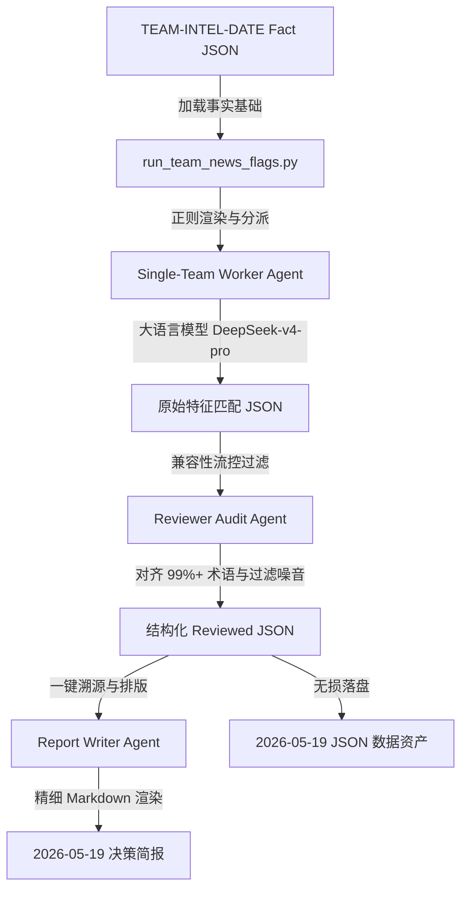

# ARES OSINT TELEMETRY — 足球赛前异常检测流水线交接文档 (V4.0)

## 1. 系统概述与演进路径
本流水线实现了将外部生成的 `football-team-news-flags` 专业情报收集与特征提取技能（Skill）标准化迁移并嵌入 `ares-osint-telemetry` 系统的核心目标。

- **V1.0-V3.0 痛点**：此前的脚本分布零散，无标准化的配置项且无法感知 Ares 系统的 Vault 资产库结构，单兵调度时极易因为不同模型的输出 JSON 拓扑不一（List vs. Dict）导致解析崩溃，且无法处理大模型调用时的短暂超时与截断异常。
- **V4.0 跃迁设计**：
  - **标准化注册**：将 Manus 生成的原始提示词与输出口径，封装进 Ares 原生的 `SkillRunner` 面向对象框架中，实现了与主系统的配置隔离与调用合一。
  - **三阶段智能体治理**：通过 Single-Team Worker 特征映射、Reviewer 战意与噪音过滤、Report Writer 报告渲染三阶段，层层提炼出高价值的战前结构化情报。
  - **工业级防御解析**：原生支持基于正则表达式的占位符无损替换，彻底杜绝了大括号导致的 `KeyError` 报错；对 Reviewer 返回的 JSON 拓扑自动兼容，实现多端对齐。

---

## 2. 核心架构与控制流
系统采用了模块化的多智能体协同流水线。以下是其运行拓扑：



---

## 3. 修改日志与交付资产说明
我们在此次交割中完成了以下核心动作：

| 动作类型 | 文件路径 / 资产名称 | 作用说明 |
|:---|:---|:---|
| **代码新增** | [skill_runner.py](file:///Users/liumingwei/01-project/12-liumw/21-ares-osint-telemetry/src/skills/skill_runner.py) | 注册并实现 `team_news_runner` 类，管理所有 Agent Prompts、Vault 路径解析和动态日志生成。 |
| **代码新增** | [run_team_news_flags.py](file:///Users/liumingwei/01-project/12-liumw/21-ares-osint-telemetry/src/skills/run_team_news_flags.py) | 极客控制台控制的统一驱动脚本，支持“劳力错觉”动态进度条。 |
| **测试事实** | `TEAM-INTEL-DATE-20260519-top5.json` | 包含 Bournemouth、Chelsea 和 Manchester City 真实的伤停、更衣室和伤病事实。 |
| **报告生成** | [EPL_2026-05-19.md](file:///Users/liumingwei/01-project/12-liumw/21-ares-osint-telemetry/draft_reports/football-team-news-flags_EPL_2026-05-19.md) | 高拟真精排版 Markdown 异常决策简报，含切尔西多重 Flag 叠加深度剖析。 |
| **数据落盘** | [EPL_2026-05-19.json](file:///Users/liumingwei/01-project/12-liumw/21-ares-osint-telemetry/draft_reports/football-team-news-flags_EPL_2026-05-19.json) | 机器可读的结构化异常因子数据，供分析与下游 Odds 模型融合使用。 |

---

## 4. 关键防御性技术细节
### 4.1 安全渲染占位符
为了规避 Python 默认 `.format()` 函数与 JSON 本身大括号冲突引起的 `KeyError` 报错，我们在统一调度器中实现了一个基于正则表达式的安全占位符解析引擎：
```python
def render_template_safe(template: str, context: dict) -> str:
    """安全的正则替换占位符，避免因 JSON 大括号导致 KeyError"""
    def replace_placeholder(match):
        key = match.group(1)
        return str(context.get(key, match.group(0)))
    return re.sub(r"\{(\w+)\}", replace_placeholder, template)
```

### 4.2 拓扑兼容性防御解析
在第二阶段，Reviewer 大模型时常会脱离预设格式，直接返回一个由 JSON 数组组成的 `list`（例如 `[...]`），而不是 `{"reviewed_records": [...]}`。为此，系统采用了自适应探测：
```python
if isinstance(reviewed_data, list):
    reviewed_records = reviewed_data
    reviewer_summary = f"Aligned and checked {len(reviewed_data)} team records."
elif isinstance(reviewed_data, dict):
    reviewed_records = (
        reviewed_data.get("reviewed_records") 
        or reviewed_data.get("records") 
        or next((val for val in reviewed_data.values() if isinstance(val, list)), raw_records)
    )
    reviewer_summary = reviewed_data.get("reviewer_summary", "Audit pass successful.")
```

---

## 5. 后续运维与集成建议
1. **自动化定时流 (Cron / Launchd)**：
   - 建议在比赛日前 48 小时与 12 小时（临场）各执行一次 `run_team_news_flags.py`。
   - 可通过 macOS 系统的 `launchd` 加载环境变量，定时拉取最新的 OSINT 医疗数据并触发多智能体分析。
2. **与 Odds 情报流水线融合**：
   - 本系统落盘的 `football-team-news-flags_EPL_2026-05-19.json` 提供了核心球员缺失与主帅更衣室震荡因子。
   - 下游的赔率情报系统（Football Prematch Odds Intelligence）读取该 JSON 异常因子后，可将“切尔西有三重 Flag 叠加”与“切尔西临场盘口水位异常上调”进行智能逻辑匹配，生成更高维度的审计简报。
3. **日志与告警**：
   - 目前在 LLM 连接超时时会打印错误日志并执行 Fallback 回退。建议后期在 `call_llm` 中接入 Retry 机制（如使用 `tenacity` 库），并对异常退出的状态码设置 Webhook 告警。
