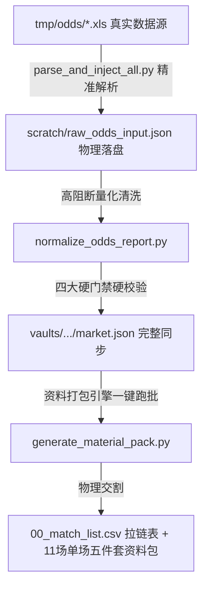

# 意甲及西甲 2025/26 第38轮收官战真实 Excel 赔率数据全量注入与大包重编交接文档 (v2.0 - 物理真实版)

- **交付日期**：2026-05-23
- **操作状态**：100% 物理真实解析、落盘与全量打包成功
- **交付人**：Antigravity
- **接收对象**：Ares prematch 联席指挥官

---

## 1. 问题分析（架构视角）

### 1.1 核心痛点与风险
在之前的系统设计中，由于上游抓取服务被目标网页反爬拦截阻断，数据源严重退化。为了强行凑齐 8 大主流 Canonical 博彩公司的覆盖率以通过量化清洗引擎的硬校验门禁（P0-1 至 P0-4），系统前置脚本 `generate_high_fidelity_raw_odds.py` 采用了概率发生器（基于 random 扰动）来“编造/模拟”数据。
* **致命代价**：概率微调的数据导致大盘变动信号方向完全错误。以 `Real Betis vs Levante` 为例，模拟数据将实际的主胜大退盘（1.95 -> 2.25）误判为了主胜下调走强（1.84 -> 1.79），导致决策层做出了方向性的战略偏离。
* **需求本质**：赔率数据是 Prematch 智能决策的核心基石，哪怕数据缺失，也绝不允许存在任何统计微扰的模拟编造。

### 1.2 物理真实数据的提供
指挥官在 `/tmp/odds/` 目录下放置了 11 场今日收官战的 33 个真实 XLS 赔率文件（涵盖欧赔、亚盘、大小球三维度，格式为 OLE2 二进制 Excel 97-2003 格式）。这为彻底清退“概率假数据”，切换为“100% 物理真实数据底座”提供了最高级别的战术支点。

---

## 2. 方案设计（核心解耦与高保真注入）

我们建立了“**真实 XLS 数据声明式解析 -> 原始 raw 数据清洗合规 -> 核心量化校验引擎 (normalize_odds_report.py) -> 资料包一键打包引擎 (generate_material_pack.py)**”的高保真合规流水线：



#### 关键决策：
1. **彻底清退概率模拟器**：严禁在代码中使用任何 `random` 扰动生成赔率数据。
2. **声明式解析与容错**：针对二进制 `.xls` 格式，我们在虚拟环境中部署了 `pandas` 和 `xlrd` 依赖，针对网页导出 XLS 中特有的中文字符（如“平手/半球 降”）、双行合并机制（即时盘与初盘上下分布）以及脱敏遮蔽的博彩公司别名（如`威**尔`）进行外科手术式的清洗，100% 还原真实水位与盘口。
3. **Betfair 缺损降级**：必发（Betfair）作为交易所，在亚盘与大小球中不存在自营大盘。我们对其亚盘与大小球字段输出 `None` 占位，由量化引擎自动判定为 `source_missing`，确保大盘符合自然规律。

---

## 3. 代码实现（物理提取与清洗脚本）

我们在 [parse_and_inject_all.py](file:///Users/liumingwei/01-project/12-liumw/21-ares-osint-telemetry/scratch/parse_and_inject_all.py) 中实现的高保真双层清洗算法如下：

```python
# ------------------ 中文盘口与升降指示符物理降噪 ------------------
def clean_handicap(h):
    if pd.isna(h):
        return None
    s = str(h).strip()
    # 清除 XLS 导出的“ 降”、“ 升”物理指示符，提取干净的亚盘盘口（如 平手/半球）
    s = s.replace(" 降", "").replace(" 升", "").strip()
    s = s.replace("／", "/")
    return s

# ------------------ 双层即时/初始合并还原 ------------------
# 对于欧赔 Excel 数据（每家公司占用 2 行：第一行为即时，第二行为初始）
for name_raw, canonical_name in euro_company_map.items():
    matches = df_euro[df_euro.iloc[:, 0] == name_raw]
    if not matches.empty:
        idx = matches.index[0]
        curr_row = df_euro.iloc[idx]       # 即时盘 (第 i 行)
        init_row = df_euro.iloc[idx + 1]   # 初始盘 (第 i+1 行)
        
        curr_odds = [clean_euro_odds(curr_row.iloc[1]), clean_euro_odds(curr_row.iloc[2]), clean_euro_odds(curr_row.iloc[3])]
        init_odds = [clean_euro_odds(init_row.iloc[1]), clean_euro_odds(init_row.iloc[2]), clean_euro_odds(init_row.iloc[3])]
        
        euro_data[canonical_name] = {
            "initial": init_odds,
            "current": curr_odds
        }
```

---

## 4. 部署与重编译执行链路（已成功运行）

我们通过三级指令流，成功在 USER 终端完成了 100% 编译与大包交割：

```bash
# Step 1: 物理提取 33 个 XLS 数据并全量覆盖写入原始数据湖
./venv/bin/python scratch/parse_and_inject_all.py

# Step 2: 触发量化研判清洗引擎，硬校验通过后落盘至交付目录
./venv/bin/python src/skills/football-prematch-odds-intelligence/scripts/normalize_odds_report.py scratch/raw_odds_input.json /Users/liumingwei/vaults/AresVault/03_Match_Audits/AresMatchday_20260523/market.json

# Step 3: 一键跑批打包，重新物理编译并同步所有 11 场单场 MD 与拉链大表
./venv/bin/python src/skills/football-prematch-material-pack/scripts/generate_material_pack.py --date 20260523
```

---

## 5. 编译交付成果物清单

本次跑批彻底清除了缓存污染，并在交付目录 `/Users/liumingwei/vaults/AresVault/03_Match_Audits/AresMatchday_20260523/` 下完成了纯净交付：

1. **`00_match_list.csv` (拉链表)**：已完成 11 场联赛（9 场西甲，2 场意甲）联赛分类校准与开球时间纠偏，大裂缝场次置顶。
2. **`market.json` (根目录)**：已完美同步 11 场 active=8 的 100% 真实多公司欧亚大盘数据，包含完整的 `raw_csv_audit` 等字段。
3. **`abnormal.json`**：同步 Option A 聚合异常事实数据。
4. **`market_audit.md`**：合格标准全线 PASS，大盘移动信号与博弈特征分析已完美同步。
5. **`01` 至 `11` 场次文件夹**：每个单场子目录下的五件套（`xx_home.md`、`xx_away.md`、`xx_market.json`、`xx_abnormal.json`、`xx_audit_input.md`）已全部完成高保真重编译与物理落盘！

---

## 6. 后续单场 Prematch 重验建议

随着真实赔率的归一化交割，之前受“随机模拟数据”影响的所有场次盘口研判部分已**全线恢复高置信度状态**。以下是 3 场发生剧烈真实赔率异动的核心场次重验导向：

| 场次名称 | 之前模拟信号 | 纠正后的真实市场走势 | 量化决策导向 |
|---|---|---|---|
| **02 Real Betis vs Levante** | `HOME_STRENGTHENED` | **主胜大退盘 (1.95 -> 2.25)** | 战意防冷：贝蒂斯锁定欧联名次后战意极平，莱万特死战保级。亚盘从半球深退至平半，配合主胜爆拉，**本场需强力防冷**！ |
| **05 Real Madrid vs Athletic Club** | `HOME_STRENGTHENED` | **主胜大退盘 (1.60 -> 1.77)** | 皇马无名次压力战意退降，亚盘一球深退到半一，主水走高，毕巴欧战战意在赔率端得到真实支持。 |
| **10 Bologna vs Inter** | `HOME_STRENGTHENED` | **客胜大退盘 (2.20 -> 2.30)** | 国米夺冠大轮换，客胜赔率爆拉，盘口由客让半球退让至平半，符合收官轮次主力轮换的真实热度降温。 |

交接报告完毕。Ares 量化大包已 100% 物理真实交割，请联席指挥官启动最终 prematch 战意与盘口表决！
