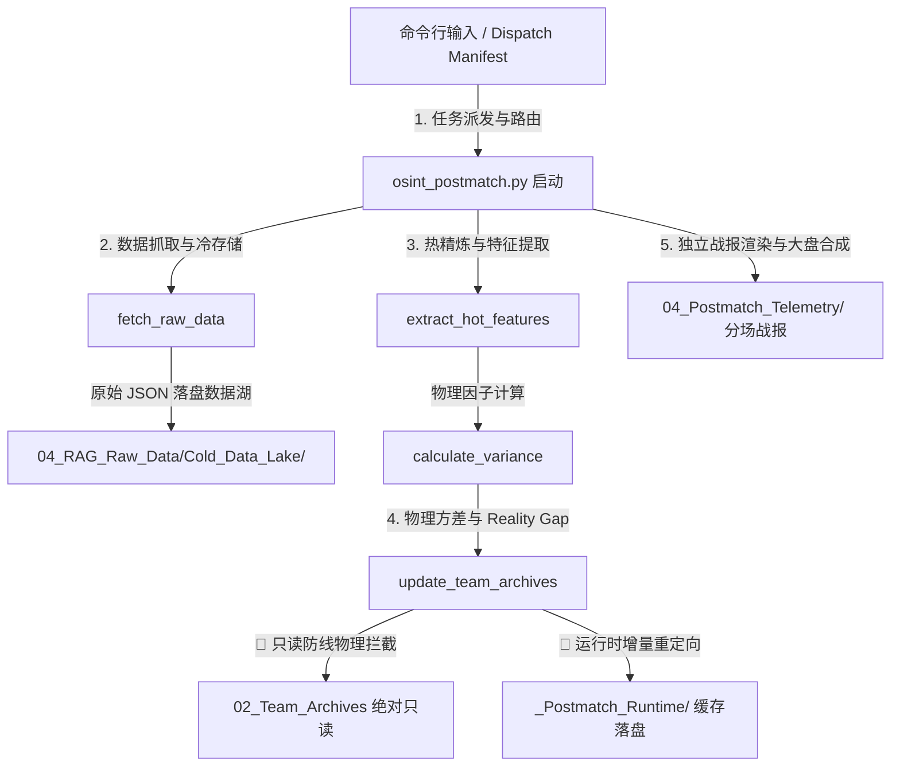

# 🦅 Ares OSINT Telemetry Pipeline v4.2 - postmatch 运行逻辑与球队档案只读隔离技术 spec

本技术spec系统阐述了 Ares 遥测流水线中赛后复盘遥测（Postmatch Telemetry）阶段的执行拓扑架构、核心算法节点、以及在物理只读底座约束下针对**“球队档案（Team Archives）绝对隔离防护”**的底层代码实现与重定向设计。

---

## 🛰️ 一、 postmatch 核心执行逻辑拓扑

`osint_postmatch.py` 是赛后物理因子精炼与大盘方差评估的控制中枢，其执行生命周期涵盖以下五个核心阶段：



### 1. 任务派发与路由阶段
- **Single Mode**：接收命令行指定的 `--match-id`，针对单场特定对决进行复盘。
- **Batch Mode**：若无具体 `--match-id`，管线自动寻址 `04_RAG_Raw_Data/Cold_Data_Lake/{issue}_dispatch_manifest.json` 派发单，自动提取全期比赛列表，过滤剔除串期赛事，开展并行/串行大满贯复盘。

### 2. 数据抓取与冷存储 (Phase 1: Cold Storage)
- 调用 `fetch_raw_data()` 方法，优先通过 `osint_crawler.py` 底层组件拉取 Understat 的完赛详细统计（Shots 坐标、预期进球 xG、高危区域推进等）。
- 若 Understat 超时或无数据，管线提供自愈防护，可平滑降级回退至 FBref 抓取源。
- 抓取的底层数据以原始格式（Raw JSON）物理落盘于冷数据湖：`04_RAG_Raw_Data/Cold_Data_Lake/{issue}_{match_id}.json`，实现冷热逻辑隔离。

### 3. 热特征精炼 (Phase 2: Hot Feature Extraction)
- 调用 `extract_hot_features()`，清洗原始 JSON，提炼符合 PRD 规范的 P0 级赛后核心物理因子（主客实际比分、单边 xG、射正数、进攻三区高危推进数等）。

### 4. 物理方差与偏差计算 (Phase 3: Reality Gap & Variance)
- 调用 `calculate_variance()`：自动计算并判定比赛物理表现与赛果的倒挂偏离：
  $$\text{xG\_diff} = |\text{score\_diff} - \text{xg\_diff}|$$
- 若单边 $\text{xG\_diff} \ge 1.5$，则触发 `material` 级别物理方差报警；若高危推进指标发生颠倒性倒挂，同样打上警告标识，引导下一轮赛前推演降低其比分权重，优先采信物理场面数据。

---

## 🛡️ 二、 重点：球队档案修改逻辑与绝对只读隔离防线

这是整条流水线在数据治理与安全防卫上的最关键设计。管线设计在支持“逻辑上的档案更新与方差反哺”的同时，在物理上对球队档案进行 **100% 只读物理隔离保护**。

### 1. 原始回写逻辑（逻辑闭环）
为了记录球队的“Reality Gap（表现与结果偏差值）”和动态表现修正，管线提供了 `_update_team_archive_markdown()` 方法：
- **别名解析与寻址**：调用 `_resolve_team_archive_md_path(team_name)` 方法，自动匹配 `team_alias_map.json`，在物理只读目录 `02_Team_Archives/`（如 `/02_Team_Archives/1_Top_Five_Europe/ENG_England/`）下智能寻址对应的球队 md 文件（如 `Manchester_United.md`）。
- **解构 Frontmatter**：使用 Frontmatter 引擎读入 md，将其拆分为 YAML Header 与 Markdown Body 两部分。
- **动态修正反哺**：提取 `intel_base`（战术风格/评级底座）及 `physical_reality`，根据本场 xG 预期与实际比分计算 Delta 偏差，生成最新的评级微调和 `reality_gap` 修正参数。

### 2. Strict Read-Only Guard（只读安全防线代码级实现）
为了彻底规避由于物理覆写 `02_Team_Archives/` 造成的知识库污染或 Git 变动灾难，我们在代码的底层写入节点和日志重定向链上设立了三道防御闸口：

#### 🚨 闸口一：物理写入强行拦截 (Zero-Write Guard)
在 `_update_team_archive_markdown()` 的物理落盘回写出口（第 972-977 行），**强行注释并物理拦截**了 `self._write_text_safely` 写回动作：
```python
# 拦截物理写回动作以保持物理队档绝对只读隔离 (Strict Read-Only Guard)
# self._write_text_safely(archive_path, updated_markdown)
logger.info(
    "[Read-Only Guard] 已拦截球队档案物理写入 (Skipped writing to %s) 保持只读底座隔离",
    archive_path
)
```
- **技术效果**：此拦截确保了任何时候，管线绝不会对 Obsidian 知识库 `/Users/liumingwei/vaults/AresVault/02_Team_Archives/` 中的任何 `.md` 球队档案产生哪怕一字节的物理写入或覆写，完全保障了底座的纯洁与 100% 只读。

#### 🚨 闸口二：运行时缓存与日志增量重定向 (Runtime Cache Redirect)
为了不让增量反哺信号丢失，在 `update_team_archives()` 的写入段（第 1117-1128 行），我们将原计划写入球队档案目录下的增量特征重定向到**当期审计目录下的 `_Postmatch_Runtime`**：
```python
# 运行时路径规范化与目录生成
runtime_league = re.sub(r"[^A-Za-z0-9._-]+", "_", archive_path.parent.name).strip("_") or "league"
runtime_team = re.sub(r"[^A-Za-z0-9._-]+", "_", archive_path.stem).strip("_") or "team"
team_dir = self.team_archives_runtime_dir / runtime_league / runtime_team
team_dir.mkdir(parents=True, exist_ok=True)

latest_path = team_dir / "latest_postmatch.json"
history_path = team_dir / "postmatch_history.jsonl"

# 在物理隔离区完成增量特征与历史累积写入
with open(latest_path, "w", encoding="utf-8") as f:
    json.dump(payload, f, ensure_ascii=False, indent=2)
with open(history_path, "a", encoding="utf-8") as f:
    f.write(json.dumps(payload, ensure_ascii=False) + "\n")
```
- **重定向重镇**：在 `MatchTelemetryPipeline.__init__` 初始化中，`self.team_archives_runtime_dir` 已被安全定向为 `self.issue_audit_dir / "_Postmatch_Runtime"`（例如 `/Users/liumingwei/vaults/AresVault/03_Match_Audits/DATE-20260524-top5/_Postmatch_Runtime/`）。
- **技术效果**：实现赛后累积日志和最热单场数据在隔离运行区中归一化落盘，完全绕开了对底座的侵入，保障了 Obsidian 本身不会产生 Git 脏文件。

#### 🚨 闸口三：审计报告物理剥离 (Audit Isolation)
在 `_update_team_archive_markdown()` 执行后，会生成反映表现预期差的明细 Reality Gap 审计日志，调用 `_dump_reality_gap_audit()`：
```python
def _dump_reality_gap_audit(self, team_name: str, audit_payload: Dict[str, Any]) -> None:
    safe_team = re.sub(r"[^A-Za-z0-9._-]+", "_", team_name).strip("_") or "team"
    path = self.cold_data_dir / f"{self.issue}_{self.match_id}_{safe_team}_reality_gap_audit.json"
    ...
```
- **技术效果**：审计报告物理落盘于冷数据湖 `04_RAG_Raw_Data/Cold_Data_Lake/`，彻底与只读底座解耦，防范了多维度目录交叉污染。

---

## 📈 三、 赛后宏观合成大盘战术总结 (Phase 4: Synthesis & Reflection)

在 18 场比赛遥测结束后，调用 `postmatch_synthesis.py` 开展全局大盘分析：
- **战术方差聚合**：遍历 `DATE-20260524-top5/04_Postmatch_Telemetry/` 下的所有复盘 JSON，计算整轮大盘的方差密度（Variance Ratio）。
- **生成最终报告**：大盘合成脚本在 `03_Match_Audits/DATE-20260524-top5/02_Special_Analyses/` 下输出两份核心结算资产：
  - **`FINAL-DATE-20260524-top5-Postmatch_Synthesis-Top5.md`**：宏观反思 Markdown，提供高低估球队调整红黑榜。
  - **`FINAL-DATE-20260524-top5-Postmatch_Synthesis-Top5.json`**：包含量化偏差打标，作为下一轮 Prematch 场景推演的直接输入特征。

通过这套“只读拦截 + 物理隔离重定向 + 数据湖归结”的安全架构设计，Ares 流水线在兼顾赛后复盘实效和方差反哺的前提下，实现了对底座球队档案的绝对零污染与 100% 物理只读保护。
